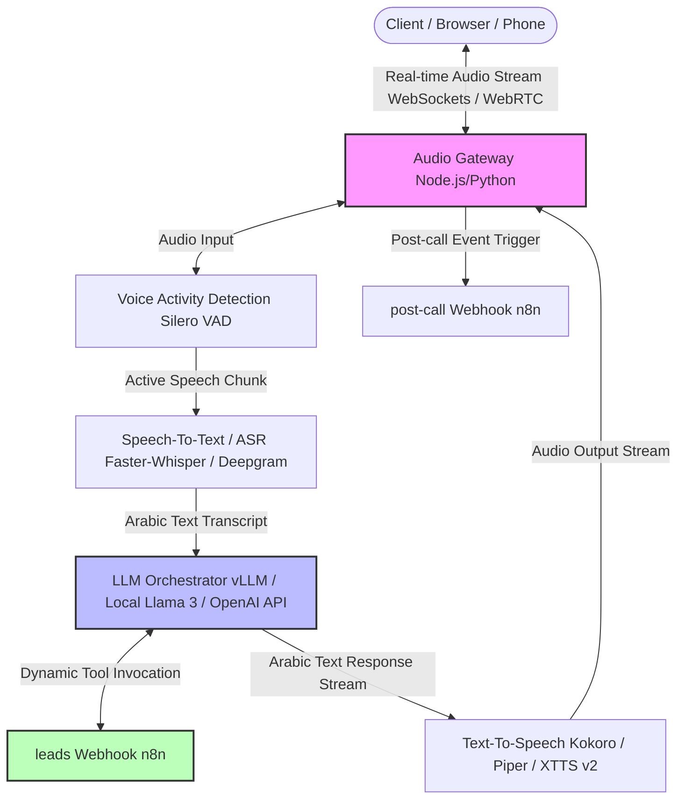

# Standalone Voice AI Agent System Architecture Plan

This document outlines the blueprint and architecture for replacing ElevenLabs with a fully standalone, self-hosted, or API-first open-source voice AI agent pipeline. The goal is to replicate the exact conversational capabilities, prompt rules, data collection (Google Sheets), and dispatch mechanisms (Email & WhatsApp transcripts via n8n) of your current system.

---

## 🏗️ System Overview & Pipeline

A standalone real-time conversational voice system splits the monolithic cloud service (ElevenLabs) into five specialized, interconnected components running locally or on self-hosted instances:



---

## 1. Real-time Audio Transport & Gateway
The entry point manages streaming low-latency audio inputs and outputs between the client and the backend models.

*   **Technology Stack**: FastAPI (Python) or Node.js utilizing **WebSockets** or **WebRTC** (via `aiortc` or `mediasoup`).
*   **Audio Protocol**:
    *   **Inbound stream**: 16kHz, 16-bit, mono PCM raw audio chunks.
    *   **Outbound stream**: 24kHz or 16kHz PCM audio buffers piped to the user’s speakers.
*   **Interruption Manager (VAD)**:
    *   Uses **Silero VAD** (Voice Activity Detection) or **WebRTCVAD** on the inbound stream.
    *   *Interruption Logic*: If VAD detects user speech while the agent is streaming audio output, the Gateway immediately sends a `CLEAR_QUEUE` signal to the outbound audio buffer and forces the TTS generator to stop speaking, simulating the ElevenLabs interruption model.

---

## 2. ASR / Speech-to-Text (Hearing)
Converts raw audio streams into text transcripts in Arabic.

*   **Open-Source Option**: **Faster-Whisper** (run on self-hosted GPU with vLLM / Docker) or **Whisper-live**.
*   **Hosted Alternative**: **Deepgram** (extremely low latency streaming ASR with direct Arabic language support).
*   **Implementation Flow**:
    *   The Audio Gateway streams PCM chunks to the ASR server.
    *   ASR outputs text in real-time using *Streaming Mode* (returning interim transcripts as the user speaks, followed by a final transcript when VAD detects a pause).

---

## 3. Conversational Orchestrator (Thinking)
The central orchestrator acts as the "brain". It tracks conversation state, enforces prompt rules, executes tools, and streams response generation.

*   **Technology Stack**: **LangChain** (Python) or **LangGraph** / custom state machine.
*   **LLM Model**:
    *   **Open-Source / Local**: **Llama-3-8B-Instruct** (Arabic fine-tuned variants) or **Qwen-2-7B-Instruct** (highly optimized for bilingual/Arabic tasks) hosted via **vLLM** or **Ollama**.
    *   **Hosted API**: **GPT-4o / GPT-4o-mini** (utilizing system instructions).
*   **State Management**:
    *   Maintains a `conversation_history` array with `{role: "user" | "assistant", message: "text"}` items.
    *   Caches user metadata (Name, Phone number, Email) in the state.
*   **Tool Calling / Action Server**:
    *   Binds a schema for `save_lead_info` to the LLM.
    *   When the LLM triggers `save_lead_info`, the orchestrator makes an HTTP `POST` request to `https://<tunnel-url>/webhook/leads` with:
        ```json
        {
          "clientName": "...",
          "phoneNumber": "...",
          "clientEmail": "...",
          "conversationId": "..."
        }
        ```
    *   The LLM pauses generation, waits for n8n's `"message": "Workflow was started"` response, and then continues speaking in Arabic.

---

## 4. TTS / Text-to-Speech (Speaking)
Converts the LLM's Arabic text output tokens into a natural, high-fidelity voice stream.

*   **Self-Hosted Models**:
    *   **Kokoro-82M**: Fast, lightweight, and produces high-quality voice with minimal GPU/CPU overhead.
    *   **XTTS v2 (Coqui)**: Supports voice cloning and handles Arabic, but has higher latency than Kokoro.
    *   **Piper**: Extremely fast, but voices can sound robotic compared to ElevenLabs.
*   **Implementation Flow**:
    *   To bypass network overhead, the TTS generator accepts LLM output text sentence-by-sentence (sentence chunking).
    *   As soon as a full sentence is generated by the LLM, it is sent to the TTS model to generate audio frames, which are immediately streamed back to the Gateway.

---

## 5. Replicating the Post-Call Trigger
In the current ElevenLabs system, a `post-call` webhook is automatically sent when the connection terminates. In the standalone architecture:

*   **Trigger Mechanism**: When the WebSocket or WebRTC connection closes (due to hangup, timeout, or silence detection), the **Audio Gateway** triggers a cleanup job.
*   **Payload Synthesis**: The gateway collects the entire state history and sends a `POST` request to `https://<tunnel-url>/webhook/post-call` mimicking the ElevenLabs structure:
    ```json
    {
      "type": "post_call_transcription",
      "event_timestamp": 1781833461019,
      "data": {
        "conversation_id": "conv_xxxx_yyyy",
        "transcript": [
          { "role": "agent", "message": "مرحبا بك...", "original_message": null },
          { "role": "user", "message": "اسمي سالم...", "original_message": null }
        ]
      }
    }
    ```
*   **Integration Compatibility**: Since this payload matches the ElevenLabs structure exactly, **the existing n8n workflow does not need any modifications**! It will seamlessly lookup the lead, format the WhatsApp payload, and send the email/WhatsApp messages exactly as it does now.

---

## 🛡️ Host/Infrastructure Recommendations

To run the open-source pipeline (ASR, LLM, TTS, Gateway) with low latency (under 1 second total round-trip response time), you will need a GPU-enabled server:

1.  **Hardware**: A single NVIDIA RTX 4090 or L4 GPU (available on RunPod, Vast.ai, or AWS EC2 `g5.xlarge`).
2.  **Software Engine**:
    *   **vLLM** for LLM inference hosting.
    *   **Faster-Whisper** running on Triton or dedicated python threads.
    *   **Kokoro-82M** running in a fast Python container.
3.  **Local Dev / Test**: Can be run locally on a Mac Studio (M2/M3) or Windows PC with an RTX 3080/4080 GPU using WSL2.
